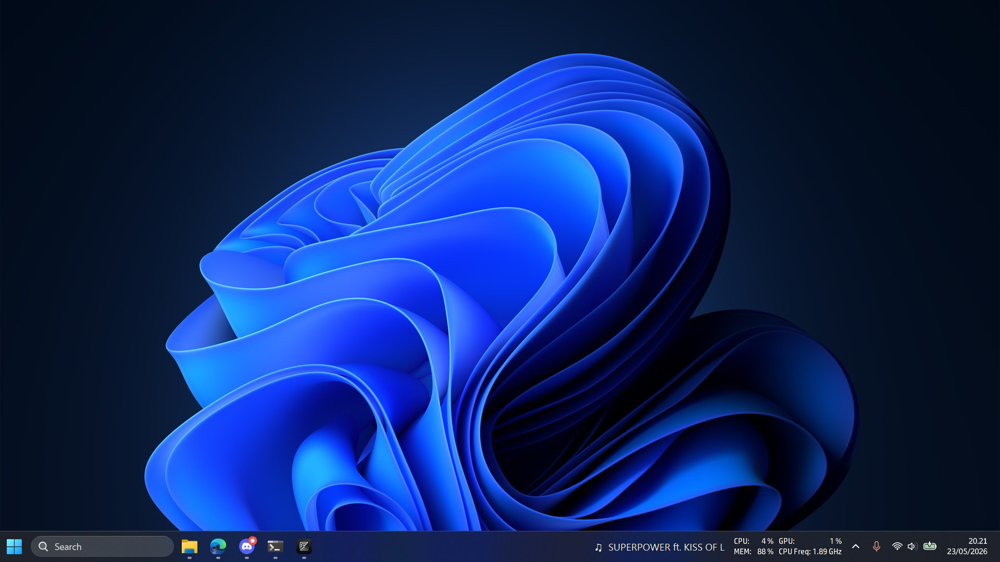

# NowOnTaskbar

Show what's playing on your Windows taskbar. Works with Spotify, YouTube, Chrome, Edge, VLC — any app that uses Windows media controls.

No browser extension. No background. No config. Just text on the taskbar.

<p align="center">
  
</p>

## Features

- **Zero setup** — detects media from any app automatically
- **Notification reader** — shows system toasts (WhatsApp, Teams, etc.) with slide animation
- **Native look** — transparent overlay, text floats directly on the taskbar
- **No browser extension** — uses built-in Windows APIs
- **Centered taskbar** — detects Windows 11 centered layout, positions correctly
- **Auto-scroll** — long titles scroll smoothly
- **Right-click tray** — toggle notifications, enable auto-start, exit

## Install

### Option 1: Download (1 minute)

1. Download `NowOnTaskbar.exe` from [Releases](../../releases)
2. Run it — no install needed
3. Play something — title appears on your taskbar

### Option 2: Build from source

```powershell
git clone https://github.com/yaffalhakim1/nowplaying-windows.git
cd nowplaying-windows
dotnet build -c Release
.\bin\Release\net9.0-windows10.0.19041.0\NowOnTaskbar.exe
```

### Notification setup (optional, one-time)

Notifications require package identity. Run once:

```powershell
.\register-sparse.ps1
```

This creates a self-signed certificate and registers a sparse MSIX package. Windows will ask "Let NowOnTaskbar read your notifications?" — click Allow.

> **Run the exe from the same folder** where you ran `register-sparse.ps1`. The package identity is path-dependent.

## Requirements

- **Windows 10 1809+** or **Windows 11**
- **[.NET 9 Desktop Runtime](https://dotnet.microsoft.com/download/dotnet/9.0)** — click "Download x64" under "Run desktop apps". The regular .NET Runtime will not work.

## Usage

| Action | How |
|--------|-----|
| Start | Run `NowOnTaskbar.exe` |
| Use | Play anything — title appears on taskbar |
| Silence notifications | Right-click tray icon, uncheck Notifications |
| Auto-start | Right-click tray icon, click Auto-start |
| Exit | Right-click tray icon, click Exit |

## How it works

**Media detection:**
1. `GlobalSystemMediaTransportControlsSessionManager` monitors all media sessions system-wide
2. When a session changes, reads `Title` + `Artist`
3. Renders text via GDI `TextRenderer` on a transparent overlay

**Notification display:**
1. `UserNotificationListener` reads system toast notifications
2. Extracts sender + message from toast XML
3. Media text slides up, notification slides in from below
4. Holds 5 seconds, slides back out — 125fps, cubic ease-out

**Taskbar positioning:**
1. Finds `Shell_TrayWnd` via `FindWindow`
2. Enumerates children, filters system windows
3. Positions overlay left of the tray area
4. Re-checks every 100ms + bumps Z-order

## Architecture

```
Program.cs              Entry point + media/notification listeners
TaskbarOverlayForm.cs   Transparent GDI overlay + scroll + slide animation
NowOnTaskbar.csproj     .NET 9 WinForms + WinRT (net9.0-windows10.0.19041.0)
Package.appxmanifest    Sparse package identity for notification access
register-sparse.ps1     One-time notification setup script
```

## Tech stack

| Layer | Tech |
|-------|------|
| Framework | .NET 9 WinForms |
| Media | `Windows.Media.Control` (WinRT SMTC) |
| Notifications | `Windows.UI.Notifications.Management` |
| Rendering | GDI `TextRenderer` + ClearType |
| Transparency | Color-key (`TransparencyKey = Black`) |
| Animation | `System.Threading.Timer` @ 8ms + `Stopwatch` |
| Taskbar position | Win32 P/Invoke (`FindWindow`, `SetWindowPos`) |

## License

MIT
